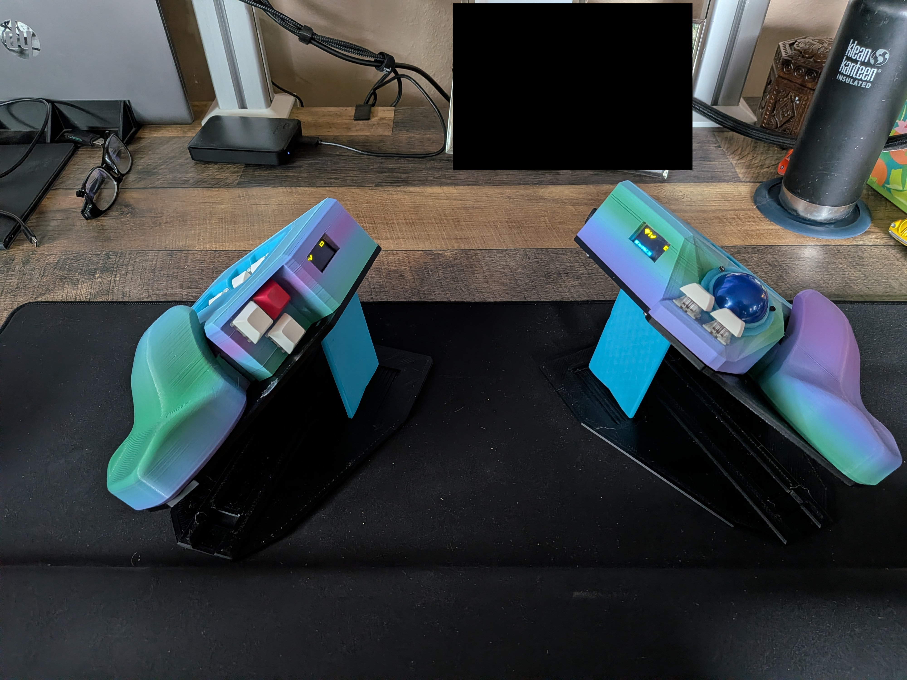
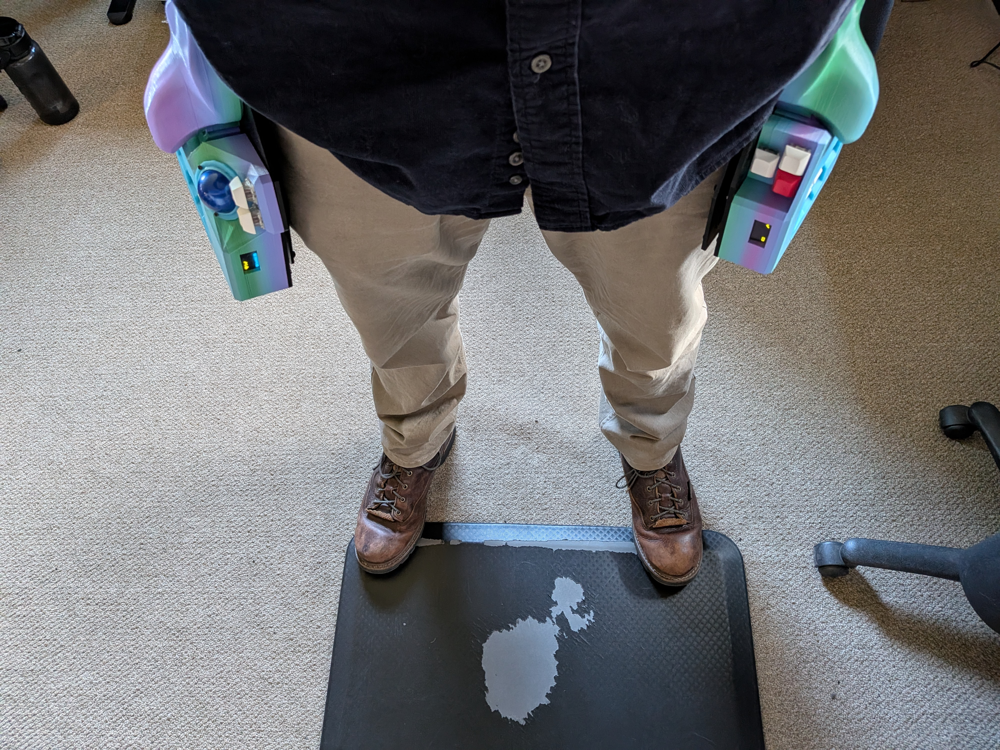

# nerdboard

This is my take on a split ergonomic keyboard.
I will add documentation to buid it here soon.

# Versions
## 1.0
This version is not my own creation. 
I found it here on [GitHub](https://github.com/Schievel1/dactyl_manuform_r_track).
This is where I started from.

## 2.0
This was my first creation.
I reduced the number of keys from 62 to 46 and tented to make it more ergonomic.
I added holes for the USB cables and reset buttons.
There was a major error on this one where I mirrored the left side to make the right. This made non of the hot swap sockets work.
This one is the most difficult to make.

## 3.0
This is my second creation.
I do not recomend this one.
It is too big.
I didn't realize until I printed it.

## 4.0
This is my third creation.
I do not recomend this one.
I never finished designing it.
Part way through I abandoned it to pursue what became 5.0.

## 5.0
This is my fourth creation.
This one is fine. 
This was the one that reduced the number of keys to 34.
I didn't know what to do with the thumb clusters so they got placed to far away.

## 6.0 
This is my fifth creation.
I really like this one. 
This one reduced the number of keys to 29.
I currently use this one daily at work.
The 29 keys make it so there is no doubt of what key you are using because each finger has a maximum of 3 keys.

### 6.2 
Stability improvement over 6.0.
The palm rest was integrated into the chassis with a slot to improve regitity. 

### 6.3
Comfortability improvement over 6.2
The top part of the palm rest was actually important for comfort and was readded.
Changed the screen to a wider model.

### 6.4 2026-05-25
Switched to wireless keyboard. https://github.com/thelowprokill/zmk-config
Added a removeable keywell to make it easier to assemble and not have doors on the front and rear.
Since it is now wireless there is now a belt hook so the keyboard can be hung from my belt.
I have now been using version 6.something for coming on three years I have been loving it.

## 7 
This is a seperate design for a friend it uses a more standard layout.

## 8
This is a prototype.
